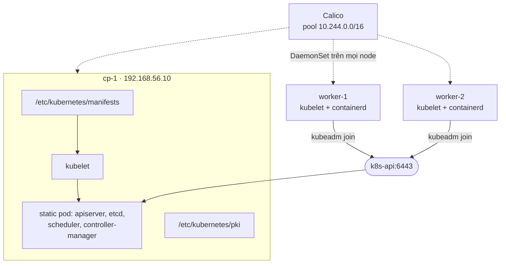
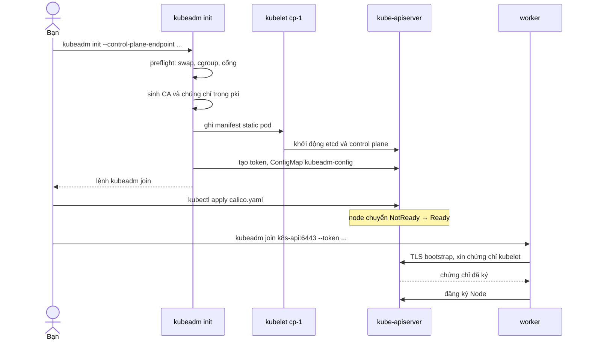

### Lab dựng gì

```mermaid
flowchart TB
  subgraph cp1 ["cp-1 · 192.168.56.10"]
    direction LR
    m["/etc/kubernetes/manifests"] --> kl0["kubelet"]
    kl0 --> sp["static pod: apiserver, etcd,<br/>scheduler, controller-manager"]
    pki["/etc/kubernetes/pki"]
  end
  w1["worker-1<br/>kubelet + containerd"] -->|"kubeadm join"| ep
  w2["worker-2<br/>kubelet + containerd"] -->|"kubeadm join"| ep
  ep(["k8s-api:6443"]) --> sp
  cni["Calico<br/>pool 10.244.0.0/16"] -.->|"DaemonSet trên mọi node"| w1
  cni -.-> w2
  cni -.-> cp1
```
`k8s-api` là tên chung cho API server. Hiện nó trỏ về cp-1; ở lab 32 nó sẽ trỏ tới cả 3 control plane.

### Luồng hoạt động

```mermaid
sequenceDiagram
  actor U as Bạn
  participant KA as kubeadm init
  participant KL as kubelet cp-1
  participant API as kube-apiserver
  participant W as worker
  U->>KA: kubeadm init --control-plane-endpoint ...
  KA->>KA: preflight: swap, cgroup, cổng
  KA->>KA: sinh CA và chứng chỉ trong pki
  KA->>KL: ghi manifest static pod
  KL->>API: khởi động etcd và control plane
  KA->>API: tạo token, ConfigMap kubeadm-config
  KA-->>U: lệnh kubeadm join
  U->>API: kubectl apply calico.yaml
  Note over API: node chuyển NotReady → Ready
  U->>W: kubeadm join k8s-api:6443 --token ...
  W->>API: TLS bootstrap, xin chứng chỉ kubelet
  API-->>W: chứng chỉ đã ký
  W->>API: đăng ký Node
```
