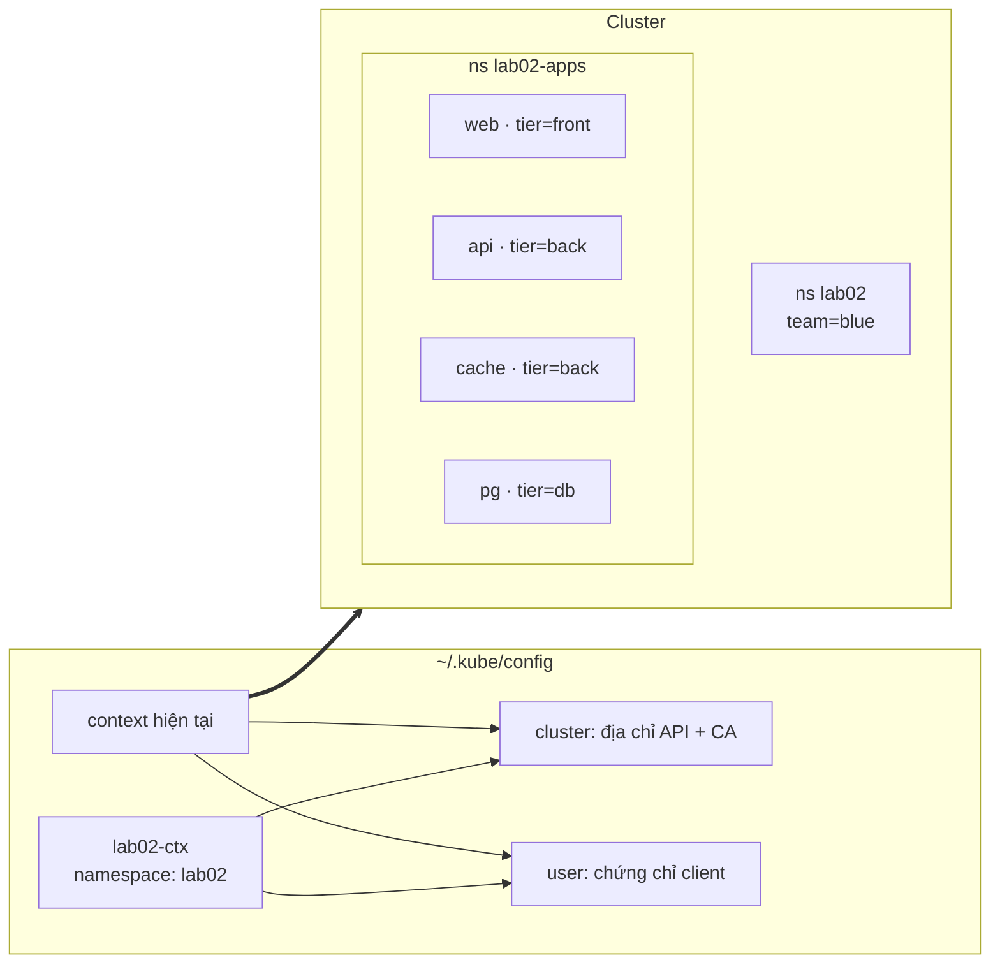
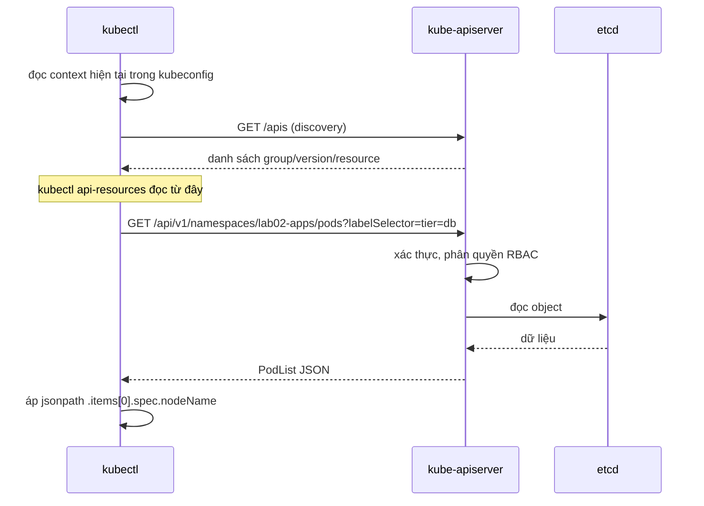

### Lab dựng gì

```mermaid
flowchart LR
  subgraph kc ["~/.kube/config"]
    c1["cluster: địa chỉ API + CA"]
    u1["user: chứng chỉ client"]
    x1["context hiện tại"] --> c1
    x1 --> u1
    x2["lab02-ctx<br/>namespace: lab02"] --> c1
    x2 --> u1
  end
  subgraph cl ["Cluster"]
    ns1["ns lab02<br/>team=blue"]
    subgraph ns2 ["ns lab02-apps"]
      p1["web · tier=front"]
      p2["api · tier=back"]
      p3["cache · tier=back"]
      p4["pg · tier=db"]
    end
  end
  x1 ==> cl
```
Context chỉ là một cặp cluster + user + namespace mặc định. Tạo context mới không đổi context đang dùng.

### Luồng hoạt động

```mermaid
sequenceDiagram
  participant K as kubectl
  participant A as kube-apiserver
  participant E as etcd
  K->>K: đọc context hiện tại trong kubeconfig
  K->>A: GET /apis (discovery)
  A-->>K: danh sách group/version/resource
  Note over K: kubectl api-resources đọc từ đây
  K->>A: GET /api/v1/namespaces/lab02-apps/pods?labelSelector=tier=db
  A->>A: xác thực, phân quyền RBAC
  A->>E: đọc object
  E-->>A: dữ liệu
  A-->>K: PodList JSON
  K->>K: áp jsonpath .items[0].spec.nodeName
```
