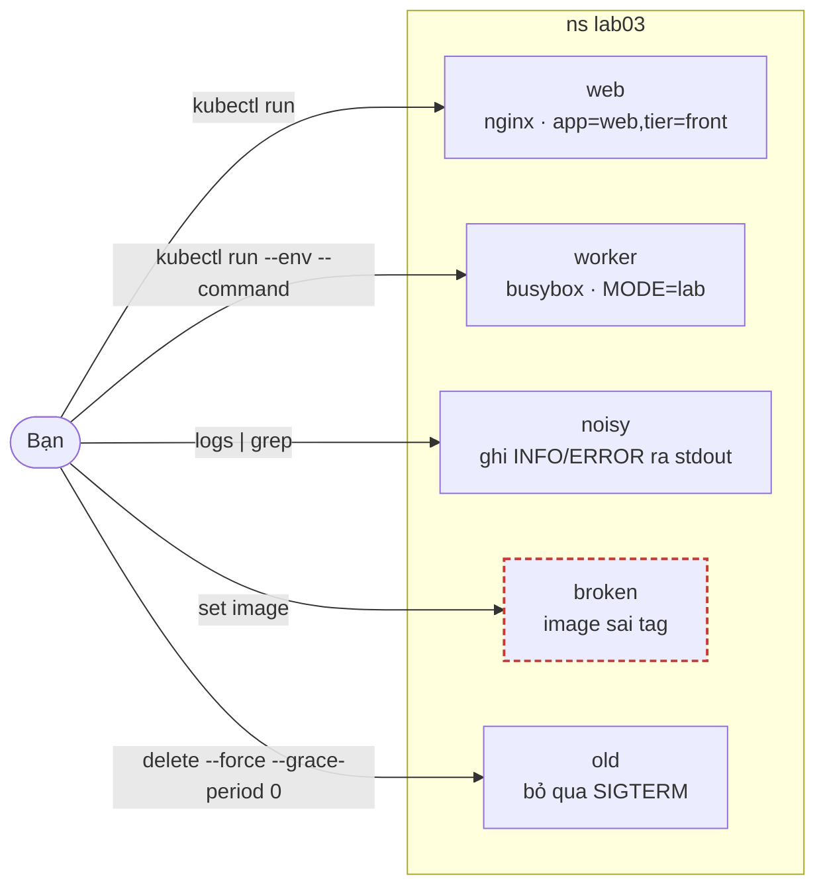
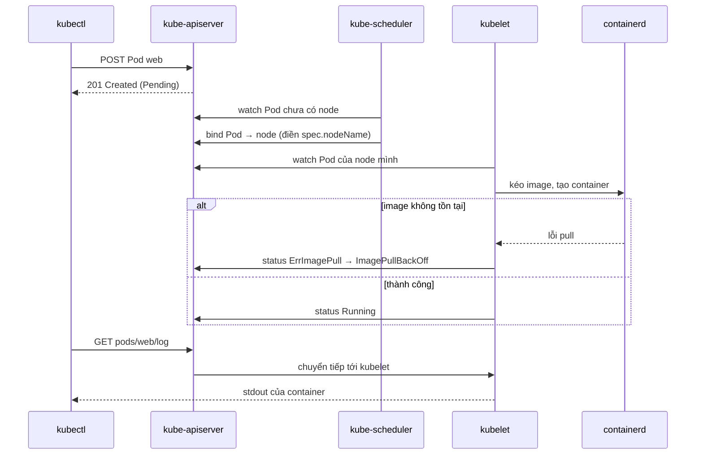

### Lab dựng gì

```mermaid
flowchart LR
  subgraph ns ["ns lab03"]
    web["web<br/>nginx · app=web,tier=front"]
    worker["worker<br/>busybox · MODE=lab"]
    noisy["noisy<br/>ghi INFO/ERROR ra stdout"]
    broken["broken<br/>image sai tag"]
    old["old<br/>bỏ qua SIGTERM"]
  end
  you(["Bạn"]) -->|"kubectl run"| web
  you -->|"kubectl run --env --command"| worker
  you -->|"logs | grep"| noisy
  you -->|"set image"| broken
  you -->|"delete --force --grace-period 0"| old
  classDef bad stroke:#C63B36,stroke-width:2px,stroke-dasharray:5 3
  class broken bad
```

### Luồng hoạt động

```mermaid
sequenceDiagram
  participant K as kubectl
  participant A as kube-apiserver
  participant S as kube-scheduler
  participant KL as kubelet
  participant R as containerd
  K->>A: POST Pod web
  A-->>K: 201 Created (Pending)
  S->>A: watch Pod chưa có node
  S->>A: bind Pod → node (điền spec.nodeName)
  KL->>A: watch Pod của node mình
  KL->>R: kéo image, tạo container
  alt image không tồn tại
    R-->>KL: lỗi pull
    KL->>A: status ErrImagePull → ImagePullBackOff
  else thành công
    KL->>A: status Running
  end
  K->>A: GET pods/web/log
  A->>KL: chuyển tiếp tới kubelet
  KL-->>K: stdout của container
```
`kubectl logs` và `kubectl exec` đi qua API server rồi tới kubelet trên node. Log không nằm trong etcd.
