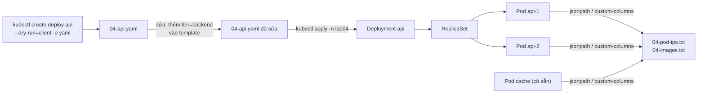
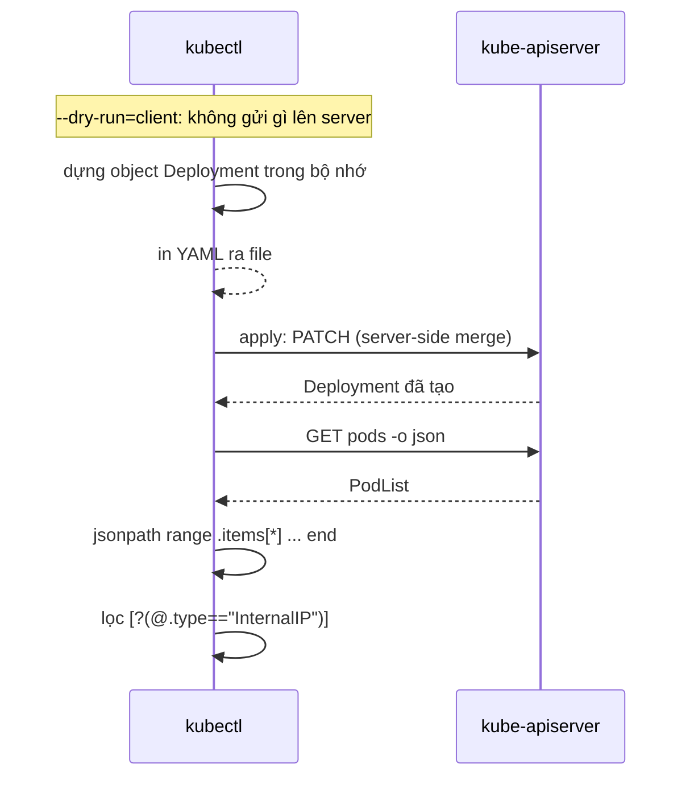

### Lab dựng gì

```mermaid
flowchart LR
  gen["kubectl create deploy api<br/>--dry-run=client -o yaml"] --> file["04-api.yaml"]
  file -->|"sửa: thêm tier=backend<br/>vào template"| file2["04-api.yaml đã sửa"]
  file2 -->|"kubectl apply -n lab04"| d["Deployment api"]
  d --> rs["ReplicaSet"] --> p1["Pod api-1"]
  rs --> p2["Pod api-2"]
  c["Pod cache (có sẵn)"]
  p1 & p2 & c -->|"jsonpath / custom-columns"| out["04-pod-ips.txt<br/>04-images.txt"]
```

### Luồng hoạt động

```mermaid
sequenceDiagram
  participant K as kubectl
  participant A as kube-apiserver
  Note over K: --dry-run=client: không gửi gì lên server
  K->>K: dựng object Deployment trong bộ nhớ
  K-->>K: in YAML ra file
  K->>A: apply: PATCH (server-side merge)
  A-->>K: Deployment đã tạo
  K->>A: GET pods -o json
  A-->>K: PodList
  K->>K: jsonpath range .items[*] ... end
  K->>K: lọc [?(@.type=="InternalIP")]
```
jsonpath và custom-columns xử lý ở phía kubectl, trên JSON mà API server trả về.
