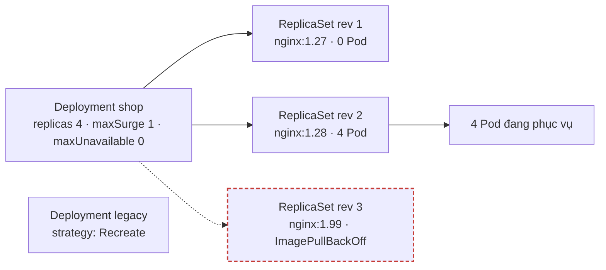
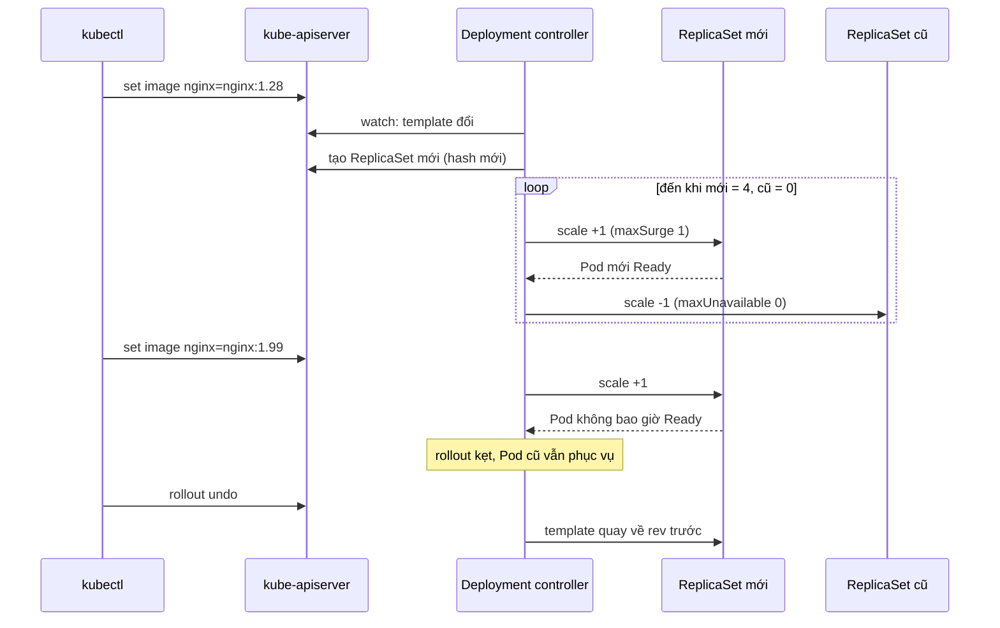

### Lab dựng gì

```mermaid
flowchart LR
  d["Deployment shop<br/>replicas 4 · maxSurge 1 · maxUnavailable 0"]
  d --> rs1["ReplicaSet rev 1<br/>nginx:1.27 · 0 Pod"]
  d --> rs2["ReplicaSet rev 2<br/>nginx:1.28 · 4 Pod"]
  d -.-> rs3["ReplicaSet rev 3<br/>nginx:1.99 · ImagePullBackOff"]
  rs2 --> p["4 Pod đang phục vụ"]
  l["Deployment legacy<br/>strategy: Recreate"]
  classDef bad stroke:#C63B36,stroke-width:2px,stroke-dasharray:5 3
  class rs3 bad
```
Mỗi lần đổi Pod template sinh một ReplicaSet mới. ReplicaSet cũ được giữ lại (tối đa `revisionHistoryLimit`) để rollback.

### Luồng hoạt động

```mermaid
sequenceDiagram
  participant K as kubectl
  participant A as kube-apiserver
  participant DC as Deployment controller
  participant N as ReplicaSet mới
  participant O as ReplicaSet cũ
  K->>A: set image nginx=nginx:1.28
  DC->>A: watch: template đổi
  DC->>A: tạo ReplicaSet mới (hash mới)
  loop đến khi mới = 4, cũ = 0
    DC->>N: scale +1 (maxSurge 1)
    N-->>DC: Pod mới Ready
    DC->>O: scale -1 (maxUnavailable 0)
  end
  K->>A: set image nginx=nginx:1.99
  DC->>N: scale +1
  N-->>DC: Pod không bao giờ Ready
  Note over DC: rollout kẹt, Pod cũ vẫn phục vụ
  K->>A: rollout undo
  DC->>N: template quay về rev trước
```
