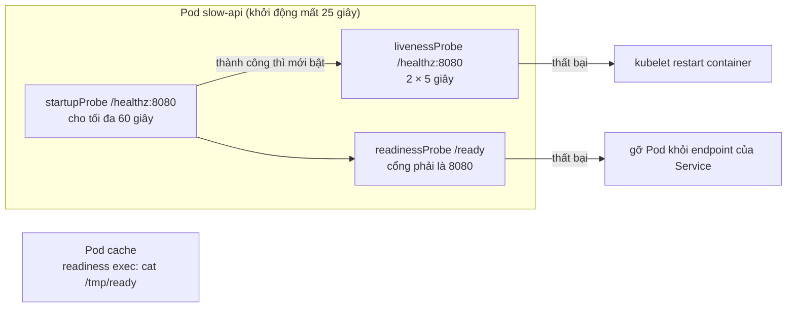
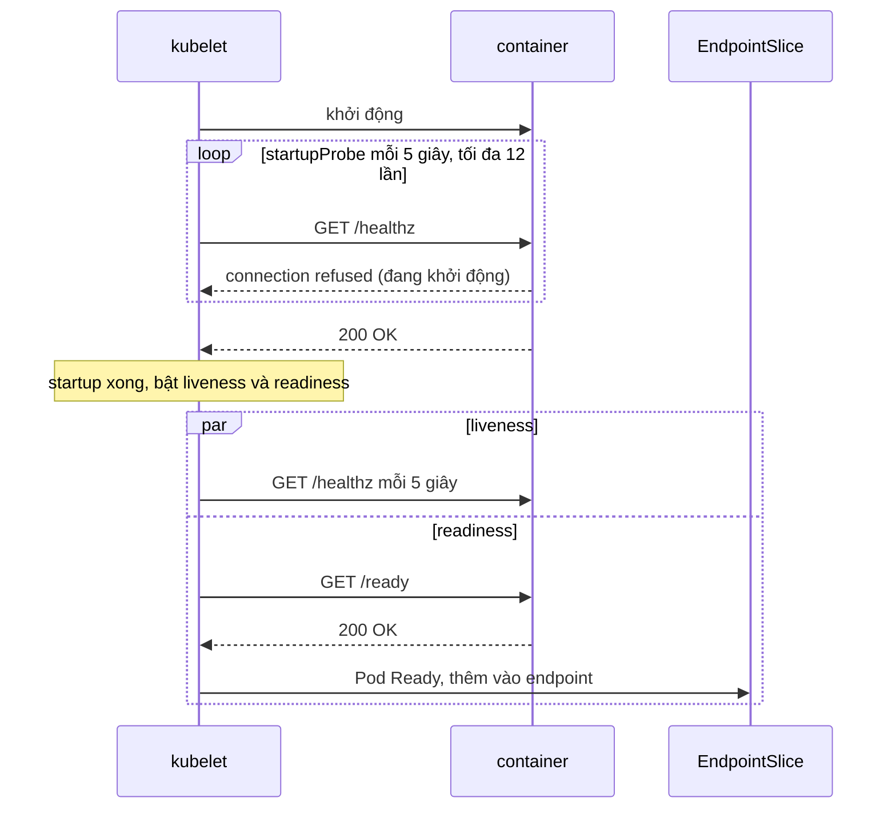

### Lab dựng gì

```mermaid
flowchart LR
  subgraph slow ["Pod slow-api (khởi động mất 25 giây)"]
    sp["startupProbe /healthz:8080<br/>cho tối đa 60 giây"]
    lp["livenessProbe /healthz:8080<br/>2 × 5 giây"]
    rp["readinessProbe /ready<br/>cổng phải là 8080"]
  end
  sp -->|"thành công thì mới bật"| lp
  sp --> rp
  lp -->|"thất bại"| restart["kubelet restart container"]
  rp -->|"thất bại"| ep["gỡ Pod khỏi endpoint của Service"]
  cache["Pod cache<br/>readiness exec: cat /tmp/ready"]
```

### Luồng hoạt động

```mermaid
sequenceDiagram
  participant KL as kubelet
  participant C as container
  participant EP as EndpointSlice
  KL->>C: khởi động
  loop startupProbe mỗi 5 giây, tối đa 12 lần
    KL->>C: GET /healthz
    C-->>KL: connection refused (đang khởi động)
  end
  C-->>KL: 200 OK
  Note over KL: startup xong, bật liveness và readiness
  par liveness
    KL->>C: GET /healthz mỗi 5 giây
  and readiness
    KL->>C: GET /ready
    C-->>KL: 200 OK
    KL->>EP: Pod Ready, thêm vào endpoint
  end
```
Không có startupProbe, liveness chạy ngay từ giây đầu và giết container trước khi nó kịp khởi động xong.
