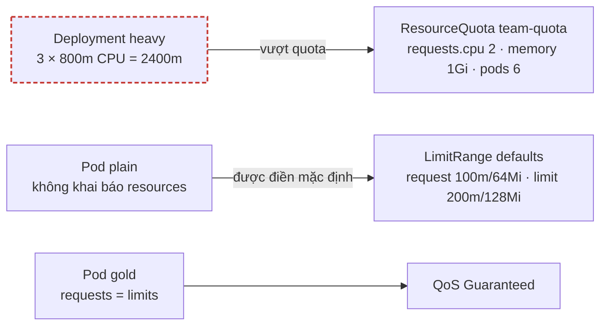
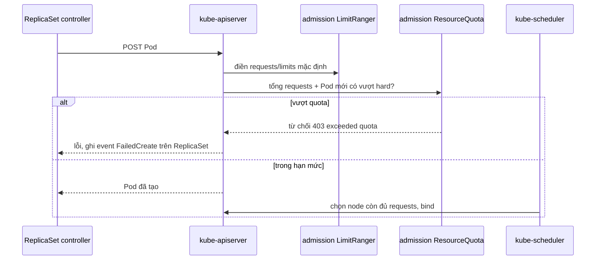

### Lab dựng gì

```mermaid
flowchart LR
  q["ResourceQuota team-quota<br/>requests.cpu 2 · memory 1Gi · pods 6"]
  lr["LimitRange defaults<br/>request 100m/64Mi · limit 200m/128Mi"]
  heavy["Deployment heavy<br/>3 × 800m CPU = 2400m"] -->|"vượt quota"| q
  plain["Pod plain<br/>không khai báo resources"] -->|"được điền mặc định"| lr
  gold["Pod gold<br/>requests = limits"] --> qos["QoS Guaranteed"]
  classDef bad stroke:#C63B36,stroke-width:2px,stroke-dasharray:5 3
  class heavy bad
```

### Luồng hoạt động

```mermaid
sequenceDiagram
  participant RS as ReplicaSet controller
  participant A as kube-apiserver
  participant LR as admission LimitRanger
  participant RQ as admission ResourceQuota
  participant S as kube-scheduler
  RS->>A: POST Pod
  A->>LR: điền requests/limits mặc định
  A->>RQ: tổng requests + Pod mới có vượt hard?
  alt vượt quota
    RQ-->>A: từ chối 403 exceeded quota
    A-->>RS: lỗi, ghi event FailedCreate trên ReplicaSet
  else trong hạn mức
    A-->>RS: Pod đã tạo
    S->>A: chọn node còn đủ requests, bind
  end
```
Lỗi quota không tạo ra Pod lỗi nào, nên phải xem event của **ReplicaSet**, không phải của Pod.
