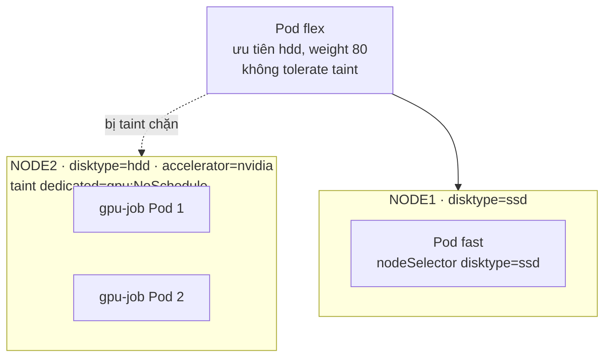
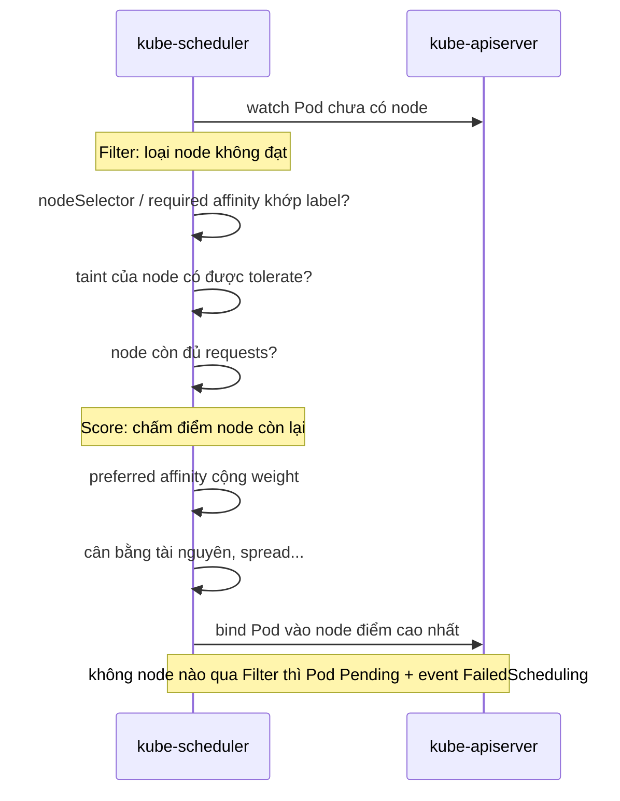

### Lab dựng gì

```mermaid
flowchart TB
  subgraph n1 ["NODE1 · disktype=ssd"]
    fast["Pod fast<br/>nodeSelector disktype=ssd"]
  end
  subgraph n2 ["NODE2 · disktype=hdd · accelerator=nvidia<br/>taint dedicated=gpu:NoSchedule"]
    g1["gpu-job Pod 1"]
    g2["gpu-job Pod 2"]
  end
  flex["Pod flex<br/>ưu tiên hdd, weight 80<br/>không tolerate taint"] -.->|"bị taint chặn"| n2
  flex --> n1
```
Taint **đẩy** Pod không phù hợp ra. Affinity **kéo** Pod về. gpu-job cần cả hai mới chỉ chạy trên NODE2.

### Luồng hoạt động

```mermaid
sequenceDiagram
  participant S as kube-scheduler
  participant A as kube-apiserver
  S->>A: watch Pod chưa có node
  Note over S: Filter: loại node không đạt
  S->>S: nodeSelector / required affinity khớp label?
  S->>S: taint của node có được tolerate?
  S->>S: node còn đủ requests?
  Note over S: Score: chấm điểm node còn lại
  S->>S: preferred affinity cộng weight
  S->>S: cân bằng tài nguyên, spread...
  S->>A: bind Pod vào node điểm cao nhất
  Note over S,A: không node nào qua Filter thì Pod Pending + event FailedScheduling
```
