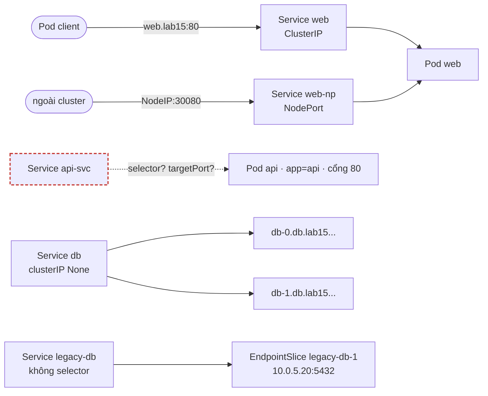
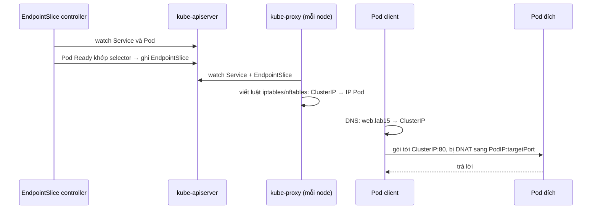

### Lab dựng gì

```mermaid
flowchart LR
  c(["Pod client"]) -->|"web.lab15:80"| s1["Service web<br/>ClusterIP"]
  out(["ngoài cluster"]) -->|"NodeIP:30080"| s2["Service web-np<br/>NodePort"]
  s1 & s2 --> w["Pod web"]
  s3["Service api-svc"] -.->|"selector? targetPort?"| a["Pod api · app=api · cổng 80"]
  h["Service db<br/>clusterIP None"] --> d0["db-0.db.lab15..."]
  h --> d1["db-1.db.lab15..."]
  l["Service legacy-db<br/>không selector"] --> es["EndpointSlice legacy-db-1<br/>10.0.5.20:5432"]
  classDef bad stroke:#C63B36,stroke-width:2px,stroke-dasharray:5 3
  class s3 bad
```

### Luồng hoạt động

```mermaid
sequenceDiagram
  participant EC as EndpointSlice controller
  participant A as kube-apiserver
  participant KP as kube-proxy (mỗi node)
  participant C as Pod client
  participant P as Pod đích
  EC->>A: watch Service và Pod
  EC->>A: Pod Ready khớp selector → ghi EndpointSlice
  KP->>A: watch Service + EndpointSlice
  KP->>KP: viết luật iptables/nftables: ClusterIP → IP Pod
  C->>C: DNS: web.lab15 → ClusterIP
  C->>P: gói tới ClusterIP:80, bị DNAT sang PodIP:targetPort
  P-->>C: trả lời
```
ClusterIP là IP ảo: không có tiến trình nào lắng nghe trên nó, chỉ có luật NAT trên mỗi node.
