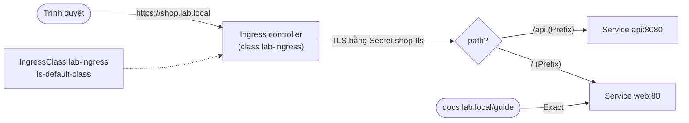
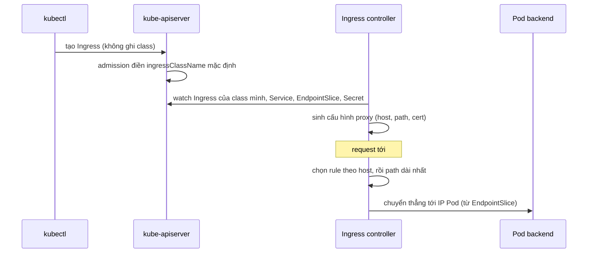

### Lab dựng gì

```mermaid
flowchart LR
  u(["Trình duyệt"]) -->|"https://shop.lab.local"| ic["Ingress controller<br/>(class lab-ingress)"]
  ic -->|"TLS bằng Secret shop-tls"| r{"path?"}
  r -->|"/api (Prefix)"| api["Service api:8080"]
  r -->|"/ (Prefix)"| web["Service web:80"]
  u2(["docs.lab.local/guide"]) -->|"Exact"| web
  cls["IngressClass lab-ingress<br/>is-default-class"] -.-> ic
```
Bài này chỉ có IngressClass, không cài controller thật, nên chấm trên các object. Với controller thật (ingress-nginx…), luồng hoạt động như sơ đồ dưới.

### Luồng hoạt động

```mermaid
sequenceDiagram
  participant K as kubectl
  participant A as kube-apiserver
  participant IC as Ingress controller
  participant B as Pod backend
  K->>A: tạo Ingress (không ghi class)
  A->>A: admission điền ingressClassName mặc định
  IC->>A: watch Ingress của class mình, Service, EndpointSlice, Secret
  IC->>IC: sinh cấu hình proxy (host, path, cert)
  Note over IC: request tới
  IC->>IC: chọn rule theo host, rồi path dài nhất
  IC->>B: chuyển thẳng tới IP Pod (từ EndpointSlice)
```
