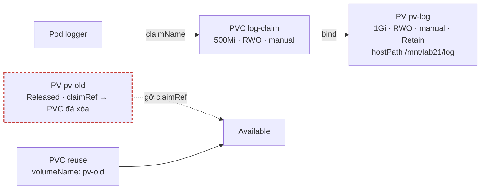
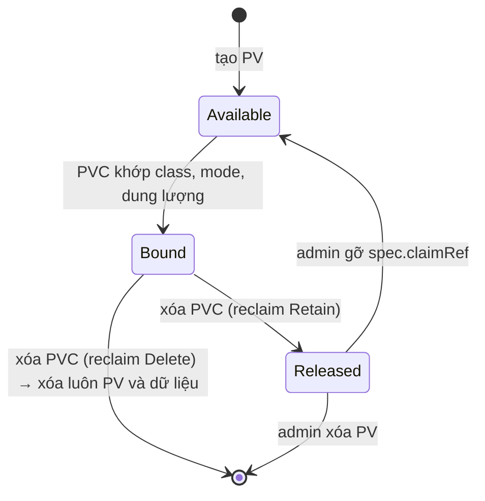

### Lab dựng gì

```mermaid
flowchart LR
  pvc["PVC log-claim<br/>500Mi · RWO · manual"] -->|"bind"| pv["PV pv-log<br/>1Gi · RWO · manual · Retain<br/>hostPath /mnt/lab21/log"]
  pod["Pod logger"] -->|"claimName"| pvc
  old["PV pv-old<br/>Released · claimRef → PVC đã xóa"] -.->|"gỡ claimRef"| av["Available"]
  reuse["PVC reuse<br/>volumeName: pv-old"] --> av
  classDef bad stroke:#C63B36,stroke-width:2px,stroke-dasharray:5 3
  class old bad
```

### Luồng hoạt động

```mermaid
stateDiagram-v2
  [*] --> Available: tạo PV
  Available --> Bound: PVC khớp class, mode, dung lượng
  Bound --> Released: xóa PVC (reclaim Retain)
  Released --> Available: admin gỡ spec.claimRef
  Bound --> [*]: xóa PVC (reclaim Delete) → xóa luôn PV và dữ liệu
  Released --> [*]: admin xóa PV
```
`Retain` giữ dữ liệu nhưng PV không tự dùng lại được, vì nó vẫn "nhớ" PVC cũ.
