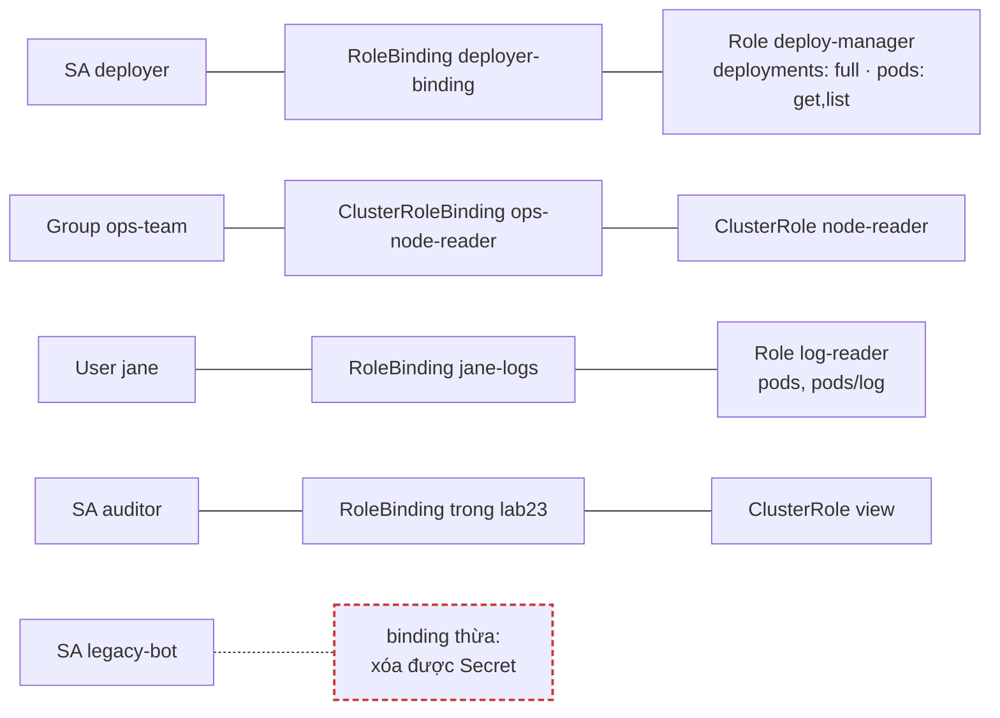
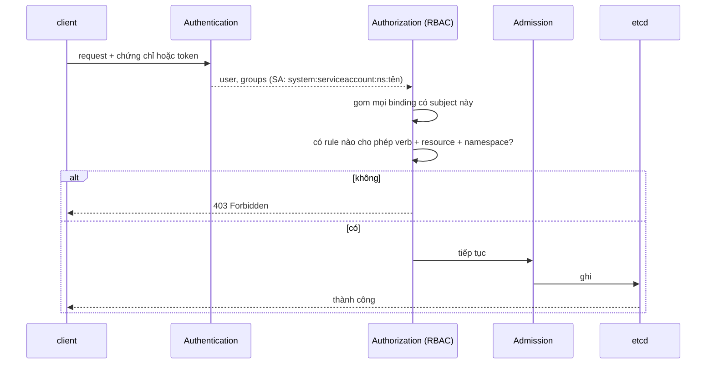

### Lab dựng gì

```mermaid
flowchart LR
  sa1["SA deployer"] --- rb1["RoleBinding deployer-binding"] --- r1["Role deploy-manager<br/>deployments: full · pods: get,list"]
  g["Group ops-team"] --- crb["ClusterRoleBinding ops-node-reader"] --- cr1["ClusterRole node-reader"]
  u["User jane"] --- rb2["RoleBinding jane-logs"] --- r2["Role log-reader<br/>pods, pods/log"]
  sa2["SA auditor"] --- rb3["RoleBinding trong lab23"] --- cr2["ClusterRole view"]
  sa3["SA legacy-bot"] -.- bad["binding thừa:<br/>xóa được Secret"]
  classDef bad stroke:#C63B36,stroke-width:2px,stroke-dasharray:5 3
  class bad bad
```

### Luồng hoạt động

```mermaid
sequenceDiagram
  participant C as client
  participant AN as Authentication
  participant AZ as Authorization (RBAC)
  participant AD as Admission
  participant E as etcd
  C->>AN: request + chứng chỉ hoặc token
  AN-->>AZ: user, groups (SA: system:serviceaccount:ns:tên)
  AZ->>AZ: gom mọi binding có subject này
  AZ->>AZ: có rule nào cho phép verb + resource + namespace?
  alt không
    AZ-->>C: 403 Forbidden
  else có
    AZ->>AD: tiếp tục
    AD->>E: ghi
    E-->>C: thành công
  end
```
RBAC chỉ có "cho phép". Không có rule nào cho phép thì bị từ chối.
