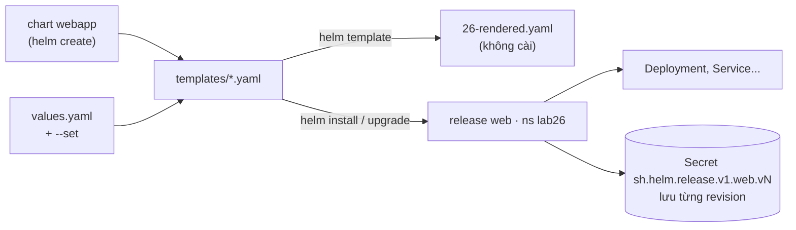
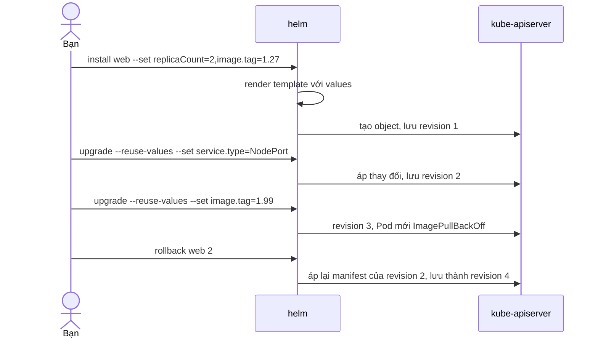

### Lab dựng gì

```mermaid
flowchart LR
  ch["chart webapp<br/>(helm create)"] --> tpl["templates/*.yaml"]
  val["values.yaml<br/>+ --set"] --> tpl
  tpl -->|"helm template"| y["26-rendered.yaml<br/>(không cài)"]
  tpl -->|"helm install / upgrade"| rel["release web · ns lab26"]
  rel --> obj["Deployment, Service..."]
  rel --> sec[("Secret sh.helm.release.v1.web.vN<br/>lưu từng revision")]
```

### Luồng hoạt động

```mermaid
sequenceDiagram
  actor U as Bạn
  participant H as helm
  participant A as kube-apiserver
  U->>H: install web --set replicaCount=2,image.tag=1.27
  H->>H: render template với values
  H->>A: tạo object, lưu revision 1
  U->>H: upgrade --reuse-values --set service.type=NodePort
  H->>A: áp thay đổi, lưu revision 2
  U->>H: upgrade --reuse-values --set image.tag=1.99
  H->>A: revision 3, Pod mới ImagePullBackOff
  U->>H: rollback web 2
  H->>A: áp lại manifest của revision 2, lưu thành revision 4
```
