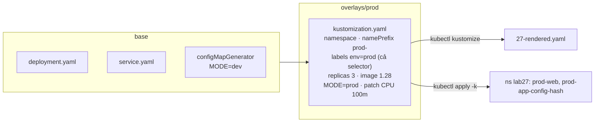
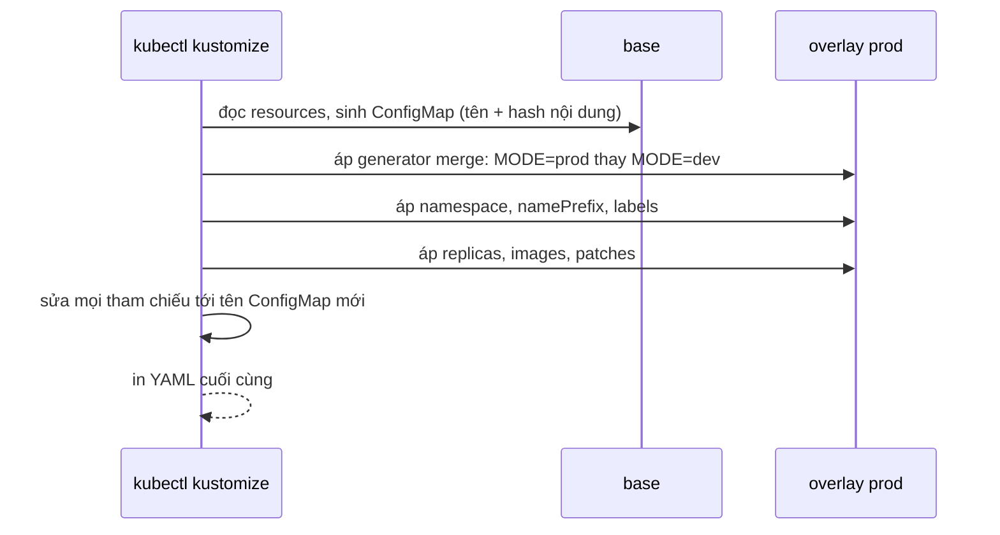

### Lab dựng gì

```mermaid
flowchart LR
  subgraph base ["base"]
    d["deployment.yaml"]
    s["service.yaml"]
    g["configMapGenerator<br/>MODE=dev"]
  end
  subgraph prod ["overlays/prod"]
    k["kustomization.yaml<br/>namespace · namePrefix prod-<br/>labels env=prod (cả selector)<br/>replicas 3 · image 1.28<br/>MODE=prod · patch CPU 100m"]
  end
  base --> k
  k -->|"kubectl kustomize"| out["27-rendered.yaml"]
  k -->|"kubectl apply -k"| cl["ns lab27: prod-web, prod-app-config-hash"]
```

### Luồng hoạt động

```mermaid
sequenceDiagram
  participant K as kubectl kustomize
  participant B as base
  participant O as overlay prod
  K->>B: đọc resources, sinh ConfigMap (tên + hash nội dung)
  K->>O: áp generator merge: MODE=prod thay MODE=dev
  K->>O: áp namespace, namePrefix, labels
  K->>O: áp replicas, images, patches
  K->>K: sửa mọi tham chiếu tới tên ConfigMap mới
  K-->>K: in YAML cuối cùng
```
ConfigMap đổi nội dung thì hash đổi, Deployment tham chiếu tên mới và tự rollout.
