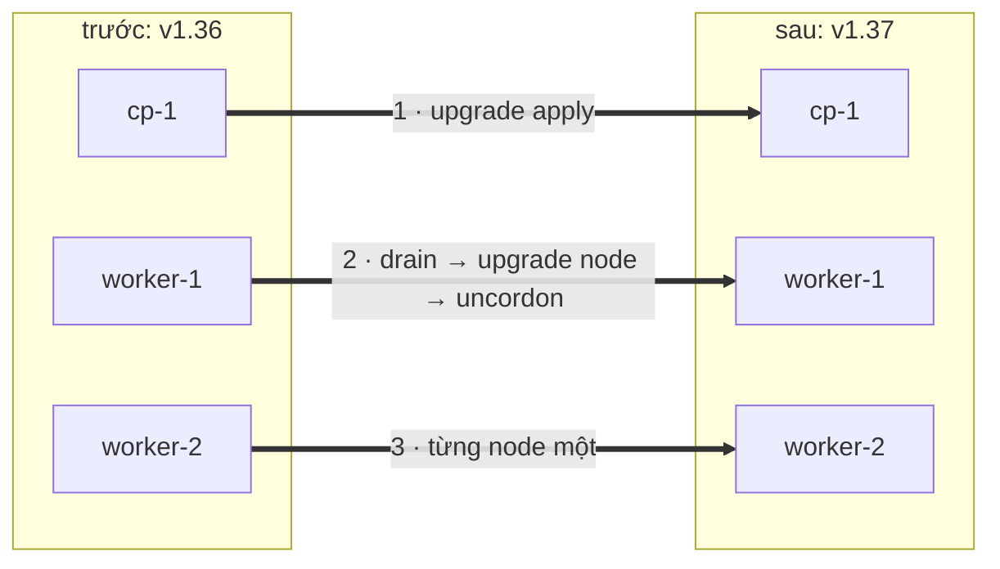
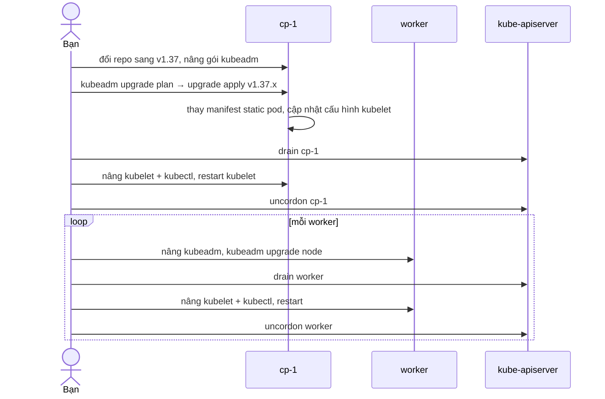

### Lab dựng gì

```mermaid
flowchart LR
  subgraph b ["trước: v1.36"]
    c1["cp-1"]
    w1["worker-1"]
    w2["worker-2"]
  end
  subgraph a ["sau: v1.37"]
    c2["cp-1"]
    w3["worker-1"]
    w4["worker-2"]
  end
  c1 ==>|"1 · upgrade apply"| c2
  w1 ==>|"2 · drain → upgrade node → uncordon"| w3
  w2 ==>|"3 · từng node một"| w4
```
Control plane luôn nâng trước. kubelet không được mới hơn kube-apiserver.

### Luồng hoạt động

```mermaid
sequenceDiagram
  actor U as Bạn
  participant CP as cp-1
  participant W as worker
  participant A as kube-apiserver
  U->>CP: đổi repo sang v1.37, nâng gói kubeadm
  U->>CP: kubeadm upgrade plan → upgrade apply v1.37.x
  CP->>CP: thay manifest static pod, cập nhật cấu hình kubelet
  U->>A: drain cp-1
  U->>CP: nâng kubelet + kubectl, restart kubelet
  U->>A: uncordon cp-1
  loop mỗi worker
    U->>W: nâng kubeadm, kubeadm upgrade node
    U->>A: drain worker
    U->>W: nâng kubelet + kubectl, restart
    U->>A: uncordon worker
  end
```
