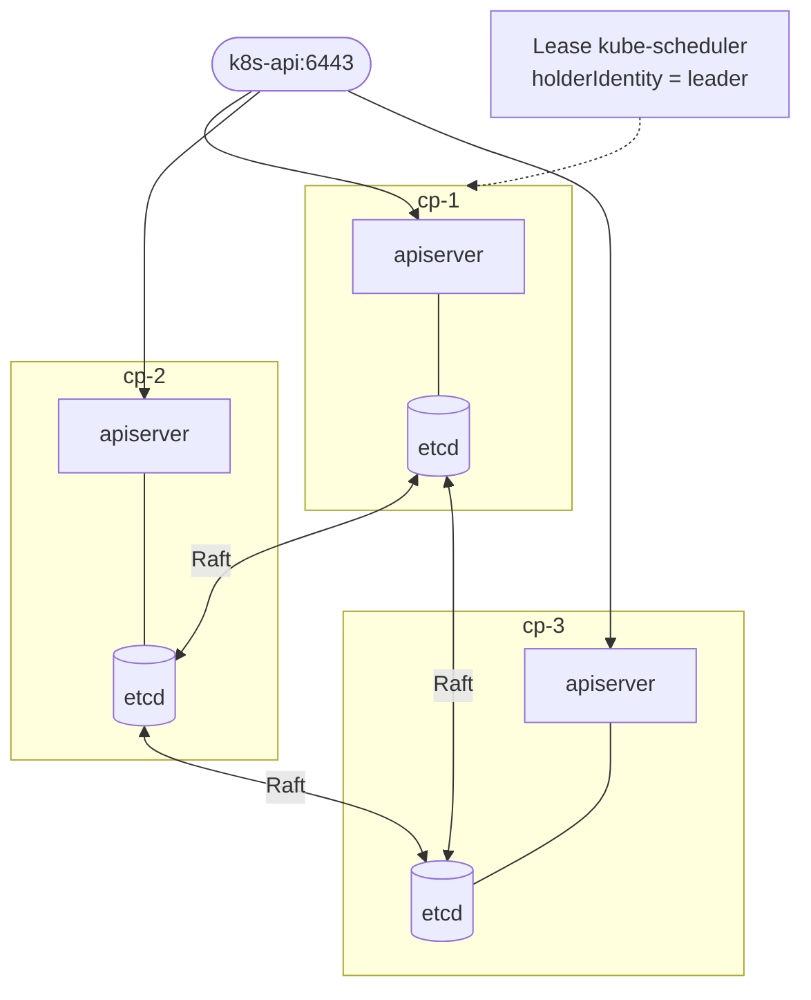
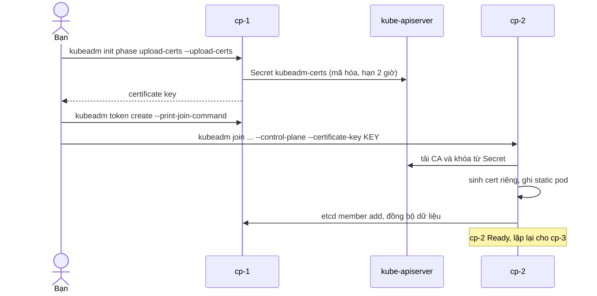

### Lab dựng gì

```mermaid
flowchart TB
  ep(["k8s-api:6443"]) --> a1 & a2 & a3
  subgraph c1 ["cp-1"]
    a1["apiserver"] --- e1[("etcd")]
  end
  subgraph c2 ["cp-2"]
    a2["apiserver"] --- e2[("etcd")]
  end
  subgraph c3 ["cp-3"]
    a3["apiserver"] --- e3[("etcd")]
  end
  e1 <-->|"Raft"| e2
  e2 <-->|"Raft"| e3
  e1 <-->|"Raft"| e3
  l["Lease kube-scheduler<br/>holderIdentity = leader"] -.-> c1
```
Ba etcd chịu được mất một node (cần 2/3 phiếu). Scheduler và controller-manager chạy trên cả 3 node nhưng chỉ leader làm việc.

### Luồng hoạt động

```mermaid
sequenceDiagram
  actor U as Bạn
  participant C1 as cp-1
  participant A as kube-apiserver
  participant C2 as cp-2
  U->>C1: kubeadm init phase upload-certs --upload-certs
  C1->>A: Secret kubeadm-certs (mã hóa, hạn 2 giờ)
  C1-->>U: certificate key
  U->>C1: kubeadm token create --print-join-command
  U->>C2: kubeadm join ... --control-plane --certificate-key KEY
  C2->>A: tải CA và khóa từ Secret
  C2->>C2: sinh cert riêng, ghi static pod
  C2->>C1: etcd member add, đồng bộ dữ liệu
  Note over C2: cp-2 Ready, lặp lại cho cp-3
```
