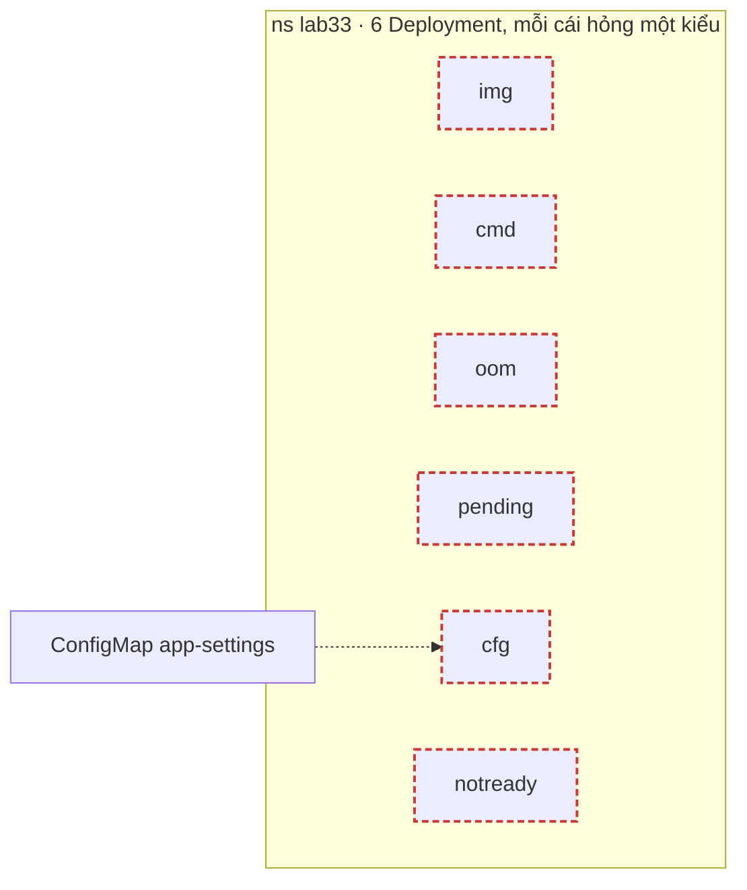
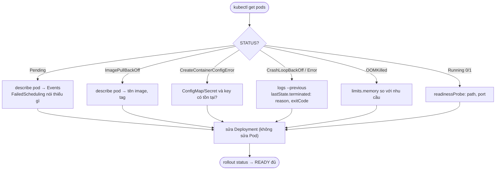

### Lab dựng gì

```mermaid
flowchart LR
  subgraph ns ["ns lab33 · 6 Deployment, mỗi cái hỏng một kiểu"]
    img["img"]
    cmd["cmd"]
    oom["oom"]
    pend["pending"]
    cfg["cfg"]
    nr["notready"]
  end
  cm["ConfigMap app-settings"] -.-> cfg
  classDef bad stroke:#C63B36,stroke-width:2px,stroke-dasharray:5 3
  class img,cmd,oom,pend,cfg,nr bad
```

### Luồng hoạt động

```mermaid
flowchart TD
  s(["kubectl get pods"]) --> st{"STATUS?"}
  st -->|"Pending"| p1["describe pod → Events<br/>FailedScheduling nói thiếu gì"]
  st -->|"ImagePullBackOff"| p2["describe pod → tên image, tag"]
  st -->|"CreateContainerConfigError"| p3["ConfigMap/Secret và key có tồn tại?"]
  st -->|"CrashLoopBackOff / Error"| p4["logs --previous<br/>lastState.terminated: reason, exitCode"]
  st -->|"OOMKilled"| p5["limits.memory so với nhu cầu"]
  st -->|"Running 0/1"| p6["readinessProbe: path, port"]
  p1 & p2 & p3 & p4 & p5 & p6 --> fix["sửa Deployment (không sửa Pod)"]
  fix --> v(["rollout status → READY đủ"])
```
Cây quyết định này dùng được cho mọi ứng dụng hỏng, trong thi lẫn ngoài thực tế.
