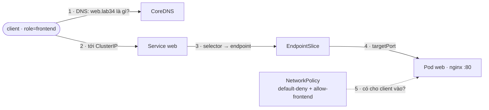
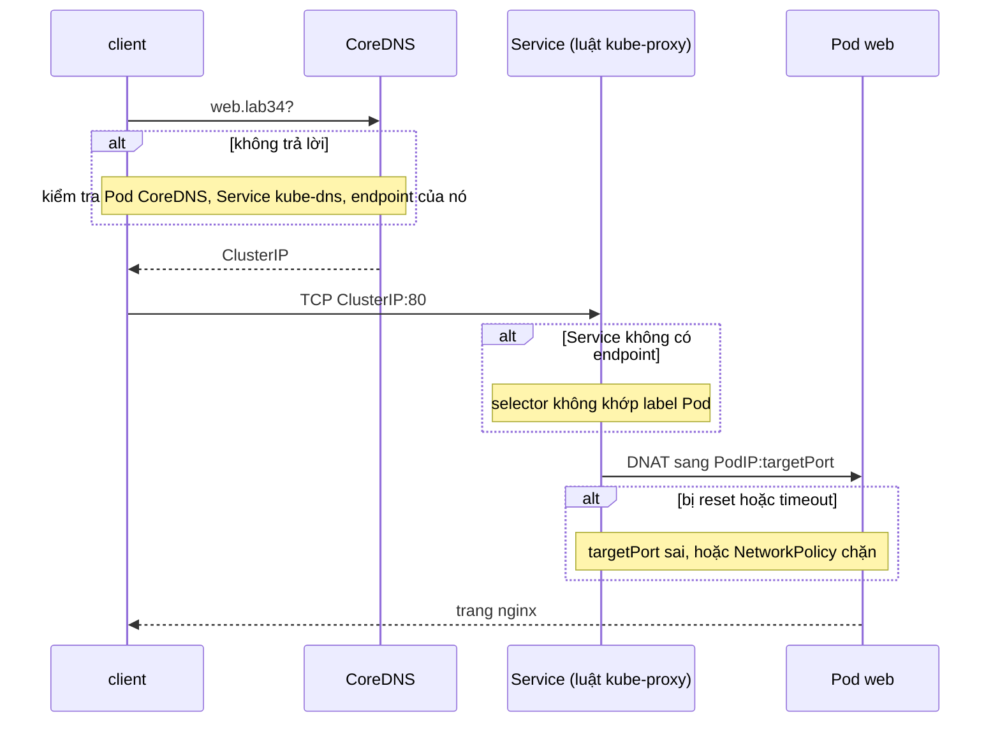

### Lab dựng gì

```mermaid
flowchart LR
  c(["client · role=frontend"]) -->|"1 · DNS: web.lab34 là gì?"| dns["CoreDNS"]
  c -->|"2 · tới ClusterIP"| svc["Service web"]
  svc -->|"3 · selector → endpoint"| es["EndpointSlice"]
  es -->|"4 · targetPort"| p["Pod web · nginx :80"]
  np["NetworkPolicy<br/>default-deny + allow-frontend"] -.->|"5 · có cho client vào?"| p
```
Mỗi mũi tên là một chỗ có thể hỏng. Kiểm tra theo đúng thứ tự 1 → 5.

### Luồng hoạt động

```mermaid
sequenceDiagram
  participant C as client
  participant D as CoreDNS
  participant S as Service (luật kube-proxy)
  participant P as Pod web
  C->>D: web.lab34?
  alt không trả lời
    Note over C,D: kiểm tra Pod CoreDNS, Service kube-dns, endpoint của nó
  end
  D-->>C: ClusterIP
  C->>S: TCP ClusterIP:80
  alt Service không có endpoint
    Note over S: selector không khớp label Pod
  end
  S->>P: DNAT sang PodIP:targetPort
  alt bị reset hoặc timeout
    Note over S,P: targetPort sai, hoặc NetworkPolicy chặn
  end
  P-->>C: trang nginx
```
