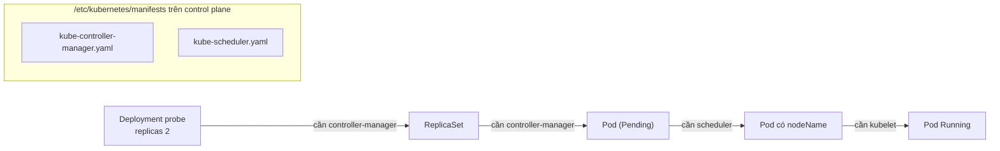
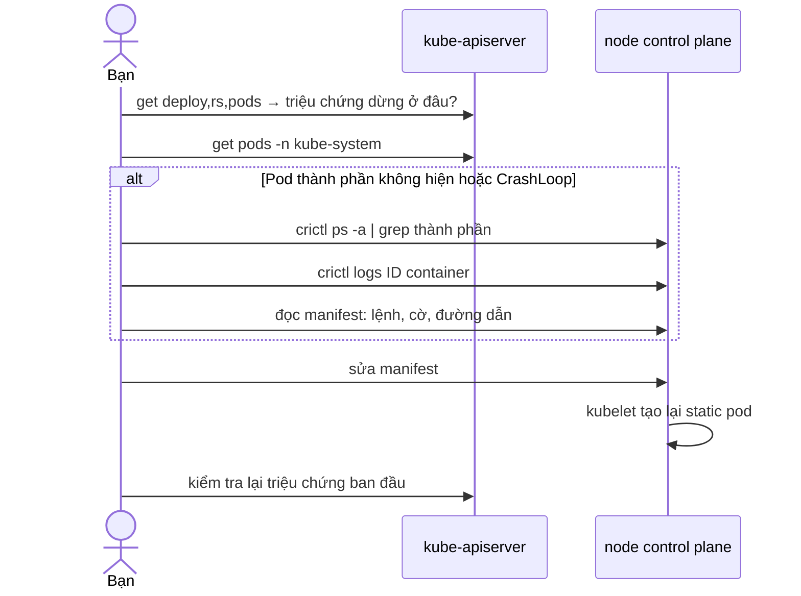

### Lab dựng gì

```mermaid
flowchart LR
  d["Deployment probe<br/>replicas 2"] -->|"cần controller-manager"| rs["ReplicaSet"]
  rs -->|"cần controller-manager"| p["Pod (Pending)"]
  p -->|"cần scheduler"| b["Pod có nodeName"]
  b -->|"cần kubelet"| r["Pod Running"]
  subgraph cp ["/etc/kubernetes/manifests trên control plane"]
    cm["kube-controller-manager.yaml"]
    sc["kube-scheduler.yaml"]
  end
```
Dừng ở bước nào thì thành phần ứng với mũi tên đó đang hỏng.

### Luồng hoạt động

```mermaid
sequenceDiagram
  actor U as Bạn
  participant A as kube-apiserver
  participant N as node control plane
  U->>A: get deploy,rs,pods → triệu chứng dừng ở đâu?
  U->>A: get pods -n kube-system
  alt Pod thành phần không hiện hoặc CrashLoop
    U->>N: crictl ps -a | grep thành phần
    U->>N: crictl logs ID container
    U->>N: đọc manifest: lệnh, cờ, đường dẫn
  end
  U->>N: sửa manifest
  N->>N: kubelet tạo lại static pod
  U->>A: kiểm tra lại triệu chứng ban đầu
```
