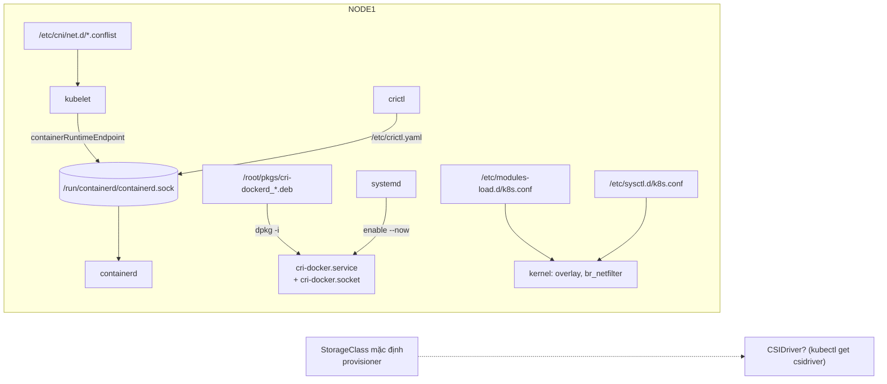
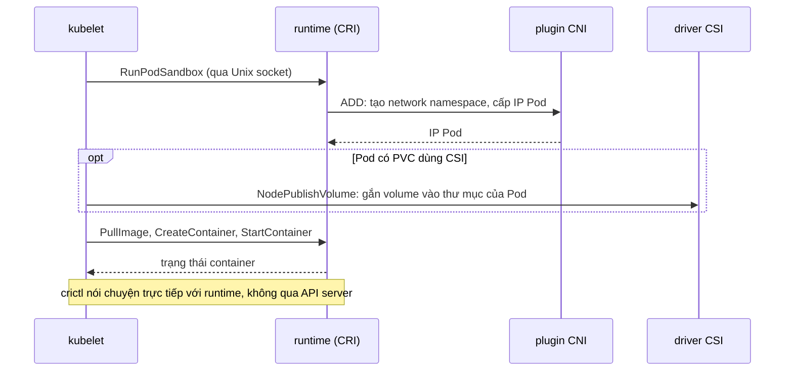

### Lab dựng gì

```mermaid
flowchart LR
  subgraph n1 ["NODE1"]
    kl["kubelet"] -->|"containerRuntimeEndpoint"| cs[("/run/containerd/containerd.sock")]
    cs --> ctd["containerd"]
    cri["crictl"] -->|"/etc/crictl.yaml"| cs
    deb["/root/pkgs/cri-dockerd_*.deb"] -->|"dpkg -i"| svc["cri-docker.service<br/>+ cri-docker.socket"]
    sd["systemd"] -->|"enable --now"| svc
    mod["/etc/modules-load.d/k8s.conf"] --> kern["kernel: overlay, br_netfilter"]
    sys["/etc/sysctl.d/k8s.conf"] --> kern
    cni["/etc/cni/net.d/*.conflist"] --> kl
  end
  sc["StorageClass mặc định<br/>provisioner"] -.-> csi["CSIDriver? (kubectl get csidriver)"]
```
CRI, CNI, CSI là ba giao diện mở rộng của kubelet: runtime container, mạng Pod, lưu trữ.

### Luồng hoạt động

```mermaid
sequenceDiagram
  participant KL as kubelet
  participant RT as runtime (CRI)
  participant CNI as plugin CNI
  participant CSI as driver CSI
  KL->>RT: RunPodSandbox (qua Unix socket)
  RT->>CNI: ADD: tạo network namespace, cấp IP Pod
  CNI-->>RT: IP Pod
  opt Pod có PVC dùng CSI
    KL->>CSI: NodePublishVolume: gắn volume vào thư mục của Pod
  end
  KL->>RT: PullImage, CreateContainer, StartContainer
  RT-->>KL: trạng thái container
  Note over KL,RT: crictl nói chuyện trực tiếp với runtime, không qua API server
```
